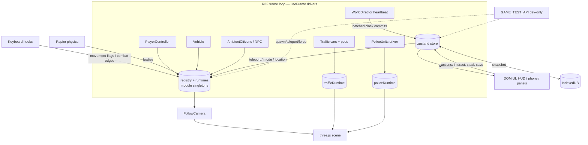

# BlockLife — Master Architecture

> The connective-tissue document. Read this first, then dive into a subsystem
> via [SYSTEMS.md](SYSTEMS.md) (deep dives), the per-feature docs, or the module
> map below. Working conventions and the hard-won gotchas live in
> [CONVENTIONS.md](CONVENTIONS.md). A one-screen map of every doc is in
> [docs/README.md](README.md).

BlockLife is an **original**, browser-based **2.5D life-sandbox** game: one
dense, low-poly city rendered as an orthographic diorama that you explore on
foot or in a small car. It is emphatically **not** GTA / Rockstar IP — every
asset is procedural, styled primitive geometry, authored in this repo.

The game has grown across ~17 feature sprints (apartment, city expansion,
solidity, visibility/occlusion, characters, traffic road-graph, world
streaming, sector authoring kit, content pack, polish, art, signals, pedestrian
crossings, destinations, crossing art, crime & law-enforcement, crime
hardening, and a mission & activity framework). It is ~30k lines of TypeScript
across 26 `src/game` subsystems, and
it stays maintainable because a handful of architectural ideas repeat
everywhere. This document is about those ideas.

---

## 1. Tech stack

| Concern | Choice |
| --- | --- |
| Build / dev server | **Vite 7** (dev on `:5173`, Playwright dev server on `:5199`) |
| UI + component model | **React 19** (StrictMode) + TypeScript (strict) |
| 3D scene | **three.js** via **@react-three/fiber** (R3F) |
| Camera / HTML labels | **@react-three/drei** (orthographic camera, `<Html>`) |
| Physics | **@react-three/rapier** (player + car rigid bodies, sector colliders) |
| Game state (reactive) | **zustand** |
| Persistence | **idb-keyval** (IndexedDB) |
| Tests | **Vitest** + Testing Library + `@react-three/test-renderer` (unit/component); **Playwright** (E2E + visual) |
| Lint | **oxlint** |

**Node is pinned to v23.3.0** (`.nvmrc` says ≥ 22.12; the dev machine uses
23.3.0). Every `npm`/`npx` invocation in this repo's tooling is prefixed with
`export PATH=$HOME/.nvm/versions/node/v23.3.0/bin:$PATH &&`.

---

## 2. The runtime, top to bottom

```
main.tsx  (StrictMode)
└─ App.tsx                     — boot, asset preflight
   └─ GameShell.tsx            — DOM overlays + global key hooks
      ├─ CanvasRoot.tsx        — the R3F <Canvas> (the 3D world)
      │  ├─ GLOBAL systems (mount once): camera, lighting, weather,
      │  │   player, vehicle, traffic, citizens, NPCs, occlusion,
      │  │   crime/police/combat, interiors, WorldDirector
      │  └─ STREAMED sectors (mount per active sector): static visuals +
      │      colliders, via SectorManager
      └─ DOM UI (React, outside the Canvas): HUD, phone, dialogue/activity/
          wardrobe/storage panels, recovery overlay, debug panel
```

Two render worlds coexist: the **3D scene** (inside `<Canvas>`, driven by the
R3F frame loop) and the **2D DOM UI** (normal React, driven by store updates).
They communicate through the zustand store and the runtime registry (below).

- [`src/app/CanvasRoot.tsx`](../src/app/CanvasRoot.tsx) — the scene graph. The
  header comment states the rule: **global systems mount once; static world
  visuals and colliders mount per streamed sector.**
- [`src/app/GameShell.tsx`](../src/app/GameShell.tsx) — mounts the Canvas + all
  DOM panels, installs the keyboard hooks, shows the loading splash until
  `registry.gameReady`.

---

## 3. The one big idea: two-tier state

This is the pattern that makes a 60 fps simulation coexist with React without
re-render storms. **Every piece of state lives in exactly one of two tiers**,
chosen by how often it changes:

### Tier 1 — the zustand store (reactive, low-frequency)
[`src/game/store/useGameStore.ts`](../src/game/store/useGameStore.ts) — the
single store. Holds what the **UI** needs to react to: stats (money, hunger,
energy, day, hour), inventory, quest states, NPC memory, play mode
(walking/driving), location (city/apartment), weather kind, UI panel state,
pause, health, the active recovery overlay. Mutated through named actions
(`interact`, `enterVehicle`, `stealVehicle`, `saveNow`, `applySnapshot`, …).
Reads trigger React re-renders — so nothing here may change every frame.

### Tier 2 — module-singleton runtimes (imperative, per-frame)
Plain exported objects that live at module scope, mutated directly inside
`useFrame`, and **never touch React state**. The canonical one is the
**registry**:

[`src/game/world/runtimeRegistry.ts`](../src/game/world/runtimeRegistry.ts)
```ts
export const registry = {
  playerBody, vehicleBody,               // rapier bodies
  playerPosition, vehiclePosition,       // THREE.Vector3, updated each frame
  playerHeading,
  npcPositions: Map<id, Vector3>,        // live people positions
  movingPersonIds: Set<id>,              // who is walking right now
  ambientCarPositions: Map<id, Vector3>,
  flags: { running, drivingSpeed, ... },
  gameReady, frameCount, pauseSeq, ...
}
```

Every subsystem that needs live, high-frequency state follows the **same
pattern** — a module singleton whose header comment says some version of *"same
pattern as traffic/weather/visibility runtimes: mutated from the frame loop,
never React state"*:

| Runtime | File |
| --- | --- |
| Traffic agents (cars + peds) | [`traffic/trafficRuntime.ts`](../src/game/traffic/trafficRuntime.ts) |
| Route plans / progress | [`traffic/routing/routeRuntime.ts`](../src/game/traffic/routing/routeRuntime.ts) |
| Weather blend / wetness (`weatherRuntime`) | [`weather/weatherSystem.ts`](../src/game/weather/weatherSystem.ts) |
| Occlusion / visibility | [`visibility/visibilityRuntime.ts`](../src/game/visibility/visibilityRuntime.ts) |
| Character instances | [`characters/characterRuntime.ts`](../src/game/characters/characterRuntime.ts) |
| Sector streaming | [`world/sectors/sectorStreaming.ts`](../src/game/world/sectors/sectorStreaming.ts) |
| Crime / wanted | [`crime/crimeRuntime.ts`](../src/game/crime/crimeRuntime.ts), [`crime/wantedRuntime.ts`](../src/game/crime/wantedRuntime.ts) |
| Police units + routes | [`police/policeRuntime.ts`](../src/game/police/policeRuntime.ts), [`police/policeRoute.ts`](../src/game/police/policeRoute.ts) |
| Weapon / health / damage / panic | [`combat/weaponRuntime.ts`](../src/game/combat/weaponRuntime.ts), [`combat/healthState.ts`](../src/game/combat/healthState.ts), [`combat/damageRuntime.ts`](../src/game/combat/damageRuntime.ts), [`combat/panicRuntime.ts`](../src/game/combat/panicRuntime.ts) |

**Why this matters for every future change:** module singletons hold **ids,
positions and scalar state — never scene objects (meshes, bodies)**. That is
exactly what lets them **survive sector streaming**: a police pursuit or a
citizen trip keeps its identity while the sector its visuals live in unmounts
and remounts. When you add a system with live state, put the durable state in a
module singleton and let the sector-owned React component render *from* it.

---

## 4. The frame loop

Every live system advances inside an R3F `useFrame((_, dt) => …)` callback.
There is no central update dispatcher — each driver component owns its slice.
The nearest thing to a heartbeat is:

- [`world/WorldDirector.tsx`](../src/game/world/WorldDirector.tsx) — *"the
  heartbeat of the simulation"*: advances the in-game clock in **batched store
  commits** (so the clock doesn't `set()` every frame), drives night-glow
  materials, scans for the nearest interactable, feeds engine audio, and sets
  `registry.gameReady` after the first frame.

Key frame-loop rules (all enforced by lessons that cost real bugs — see
[CONVENTIONS.md](CONVENTIONS.md)):

- **Use the real, clamped delta.** Second-based accumulators (arrest holds,
  fire cadence, search timers, panic windows) must use
  `useFrame((_, rawDt) => { const dt = Math.min(rawDt, 0.05) })`, **never a
  hardcoded `1/60`.** Headless E2E runs slower than 60 fps; a hardcoded delta
  makes timers advance per-frame instead of per-second and stalls the test.
- **Register runtime bodies in effects, not `useMemo`.** Under StrictMode the
  render/`useMemo` phase runs twice; registration belongs in `useEffect` with
  an identity-guarded cleanup so a double-invoke can't leave a stale singleton.
- **Batch store writes.** Per-frame `set()` calls cause re-render storms; the
  WorldDirector accumulates time and commits on a cadence.

---

## 5. Determinism & the pause model

The simulation is **deterministic by construction** so that visual-regression
baselines and timing-sensitive E2E are stable:

- **Seeded RNG, never `Math.random()` in the sim.** Route choices, police shot
  accuracy, spread, etc. hash a stable key
  ([`traffic/routing/routeRng.ts`](../src/game/traffic/routing/routeRng.ts),
  `createRng(hashString(key))`). Cosmetic-only randomness (speech-bubble timing)
  may use `Math.random`.
- **A* ties break on segment id** so the same inputs always yield the same
  route.
- **Pause snaps to canonical poses.** `store.setWorldPaused(true)` bumps
  `registry.pauseSeq`; every animated actor (NPCs, ambient cars, smoke, birds,
  police, the signal clock) snaps to a deterministic pose **once per pause**,
  keyed on `pauseSeq`, so a paused frame is pixel-identical every run. Visual
  tests pause the world, teleport actors to fixed spots in the **same
  synchronous call**, then screenshot.
- The **road graph is global and immutable** at runtime — routing reads it, never
  mutates it.

---

## 6. World structure & sector streaming

The world is a grid of **144×144-unit sectors** (origin `(-72,-72)`),
[`world/sectors/worldGrid.ts`](../src/game/world/sectors/worldGrid.ts). Nine
sectors are authored today
([`world/sectors/sectorRegistry.ts`](../src/game/world/sectors/sectorRegistry.ts)):
the original six-block Central Neighborhood (`s0_0`), two backdrop shelves, and
the expansion sectors Downtown Gateway, Main Street East/North, Waterfront,
Residential East, Industrial Yard.

**Streaming lifecycle** (`unloaded → loading → warm → active → unloading`,
[`world/sectors/sectorStreaming.ts`](../src/game/world/sectors/sectorStreaming.ts)):
a **pure policy** (`computeDesiredLifecycles`) decides what each sector *should*
be from the player's position + neighbours + any teleport destination; a
scheduler steps sectors toward that, one lifecycle transition at a time.
**Simulation tiers** decouple "is it drawn" from "is it simulated": a warm
sector can keep dormant citizens/traffic alive analytically while its visuals
are unmounted, so a trip or pursuit is never lost at a boundary.

**Teleport coordinator**
([`world/sectors/teleportCoordinator.ts`](../src/game/world/sectors/teleportCoordinator.ts)):
**every** teleport (test API, save/load, apartment exit, phone map) funnels
through `registry.teleportPlayer`. If the destination sector isn't streamed in,
the move **defers** — the coordinator makes the destination top streaming
priority and commits the move only once visuals + colliders report ready, so
the player never lands in an unbuilt sector.

Deep dive: [LARGE_CITY_FOUNDATION.md](LARGE_CITY_FOUNDATION.md). Authoring new
sectors: [DISTRICT_AUTHORING_KIT.md](DISTRICT_AUTHORING_KIT.md).

---

## 7. Authoring new city content

Static world content is **data, compiled to a scene**, not hand-placed meshes.
The **District Authoring Kit**
([`world/authoring/`](../src/game/world/authoring/)) takes a declarative sector
spec (lots, roads, buildings, water, props from a **template catalog**),
validates it (`validateCompiledSectorContent`), and compiles it to renderable
content owned by the sector. Signals, pedestrian crossings, crossing surface
art, and citizen destinations are all authored the same way — as compiled
metadata attached to a sector. Full recipe + template catalog + validation
rules: [DISTRICT_AUTHORING_KIT.md](DISTRICT_AUTHORING_KIT.md).

---

## 8. Rendering, materials & visibility

- **Orthographic follow camera**
  ([`camera/FollowCamera.tsx`](../src/game/camera/FollowCamera.tsx)) — fixed
  isometric angle, smoothly follows player-on-foot or car; wheel zoom.
- **Day/night materials.** WorldDirector drives night-glow emissive materials
  from the clock; [`world/materials.ts`](../src/game/world/materials.ts) and
  the surface/facade art layer add road/sidewalk/grass detail and building-front
  dressing ([`world/surfaces/`](../src/game/world/surfaces/)).
- **Occlusion / cutaway** ([`visibility/`](../src/game/visibility/)) — when a
  building would hide the player, its materials fade out. A broad-phase corridor
  test plus a precise per-occluder detection feed a material-fade engine
  (`Occludable` components + `OcclusionManager`). Deep dive in
  [SYSTEMS.md](SYSTEMS.md#visibility--occlusion).
- **Unified solidity.** Buildings, props, water and fences contribute footprints
  to one solid table
  ([`world/solidFootprints.ts`](../src/game/world/solidFootprints.ts),
  `propSolidity.ts`, `collisionQuery.ts`) used for player/vehicle collision,
  NPC/police avoidance, and route validation — one source of truth for "what is
  solid".

---

## 9. Save / load

[`save/saveGame.ts`](../src/game/save/saveGame.ts) — a single IndexedDB slot.
`createSnapshot` captures **only persistent state** (stats, inventory, quests,
NPC memory, player position, weather, appearance, health) via `structuredClone`;
`isValidSave` validates on load and treats newer fields (weather, appearance,
health) as **optional** so old saves still load. The policy is **safety over
persistence**: saving is refused during an active pursuit, and every load runs
`resetCrimeSystems()` + `resetCombatSystems()` first, so **a load never restores
a chase, wanted level, police, or a drawn weapon** — only durable life state
carries over. Positions saved inside the apartment are rewritten to the street
entrance. Details: [SYSTEMS.md](SYSTEMS.md#save--load) and the save/load section
of [CRIME_LAW_ENFORCEMENT.md](CRIME_LAW_ENFORCEMENT.md).

---

## 10. Test infrastructure

Three layers, all run from the pinned Node:

1. **Unit / component** — Vitest (`npm run test`). Pure logic (routing, rules,
   state machines, decisions) is factored into side-effect-free functions and
   tested directly; R3F components use `@react-three/test-renderer`. ~729 tests.
2. **E2E** — Playwright over the dev server on `:5199`
   (`npm run test:e2e`). Deterministic via a dev-only **`window.GAME_TEST_API`**
   ([`test/gameTestApi.ts`](../src/game/test/gameTestApi.ts)) that exposes
   spawn/teleport/force hooks. ~157 tests across 25 specs, incl. long soak
   tests. **The test API is guarded by `import.meta.env.DEV` and verified absent
   from the production `dist/`** (grep count 0) — production ships no test hooks.
3. **Visual** — Playwright screenshot baselines (`npm run test:visual`). Scenes
   are made deterministic by pausing the world and teleporting actors to fixed
   spots before the shot. ~83 baselines.

**Honest gates.** Verification scripts assert `passed == DEFINED` (expected
counts derived from the spec files, never hardcoded), `failed == 0`,
`skipped == 0`, guard against stray `.only`/`.skip`, and use `set -o pipefail`
so a truncated reporter line can't hide a failure:
[`scripts/crime-gate.sh`](../scripts/crime-gate.sh) (crime-scoped) and
[`scripts/hardening-gate.sh`](../scripts/hardening-gate.sh) (full regression).
More on the philosophy and the pitfalls in [CONVENTIONS.md](CONVENTIONS.md).

---

## 11. Module map

Each `src/game/*` subsystem, what it owns, its key files, and where it's
documented. (LOC excludes tests.)

| Subsystem | Owns | Key files | Doc |
| --- | --- | --- | --- |
| **world** (10.7k) | Grid, sector streaming, authoring kit, buildings, roads, districts, surfaces/facade art, solidity, the registry, WorldDirector | `runtimeRegistry.ts`, `WorldDirector.tsx`, `sectors/*`, `authoring/*`, `surfaces/*`, `solidFootprints.ts`, `Buildings.tsx`, `Roads.tsx` | [LARGE_CITY_FOUNDATION](LARGE_CITY_FOUNDATION.md), [AUTHORING_KIT](DISTRICT_AUTHORING_KIT.md) |
| **traffic** (5.0k) | Road graph + A* routing, route runtime/recovery, lane-follow, signals, intersections, pedestrian crossing rules, obstacle avoidance | `routing/*`, `signalRules.ts`, `intersections/*`, `pedestrianRules.ts`, `trafficRuntime.ts` | [SYSTEMS §Traffic](SYSTEMS.md#traffic--routing), [AUTHORING_KIT](DISTRICT_AUTHORING_KIT.md) |
| **citizens** (1.9k) | The ambient crowd: data-driven residents, daily routines, destination trips, crossing etiquette, panic | `AmbientCitizens.tsx`, `ambientCitizenData.ts`, `destinations/*` | [SYSTEMS §Citizens](SYSTEMS.md#citizens--destinations) |
| **missions** (1.6k) | Data-driven mission framework: definitions, anchors, objective engine, events, rewards/receipts, cooldowns, validation, persistence, markers, director | `missionDefinitions.ts`, `missionAnchors.ts`, `missionEngine.ts`, `missionRuntime.ts`, `missionBridge.ts`, `MissionDirector.tsx`, `MissionMarkers.tsx` | [MISSIONS](MISSIONS_AND_ACTIVITIES.md) |
| **criminalActivities** (1.6k) | Store-robbery subsystem: definitions, robbery/cashier state machines, seeded loot, unsecured proceeds + receipts, alarm→crime bridge, threat director, validation, persistence, markers; **police containment/breach phase machine** (Getaway Polish v1) | `activityDefinitions.ts`, `robberyEngine.ts`, `activityRuntime.ts`, `activityBridge.ts`, `ActivityDirector.tsx`, `containmentLogic.ts` | [CRIMINAL_ACTIVITIES](CRIMINAL_ACTIVITIES.md) |
| **interiors** (1.1k) | Reusable interior registry (apartment + store interiors), enter/exit teleport flow, store scene/colliders; **routed store civilians** (seeded flee/hide/freeze, best-effort seek + interior avoid, witness report) | `interiorRegistry.ts`, `ApartmentInterior.tsx`, `StoreInteriors.tsx`, `interiorCivilians.ts`, `interiorCivilianLogic.ts` | [CRIMINAL_ACTIVITIES](CRIMINAL_ACTIVITIES.md) |
| **items** (0.6k) | Typed item catalog + pure inventory service (stacks, capacity = occupied slots, atomic add/remove/transfer) + pure item-effect interpreter (Personal Economy v1) | `itemCatalog.ts`, `itemTypes.ts`, `inventoryService.ts`, `itemEffects.ts`, `itemValidation.ts` | [PERSONAL_ECONOMY_INVENTORY](PERSONAL_ECONOMY_INVENTORY.md) |
| **commerce** (0.8k) | One reusable shop engine + store defs (reuse robbery interiors/registers), deterministic persistent stock + lazy game-hour restock, purchase gate + bounded receipts, shopfront projection | `storeDefinitions.ts`, `commerceEngine.ts`, `stockLogic.ts`, `commerceRuntime.ts`, `shopView.ts`, `commercePersistence.ts` | [PERSONAL_ECONOMY_INVENTORY](PERSONAL_ECONOMY_INVENTORY.md) |
| **world/integrity** (1.2k) | Semantic entity registry (mirror) + spatial hash + universal person occupancy resolver + observe-only anomaly detection (DEV ~4 Hz) + viewport-clamp math + occlusion-parity certification (World Integrity v1) | `entityRegistry.ts`, `spatialHash.ts`, `occupancy.ts`, `anomalyDetector.ts`, `viewportClamp.ts`, `occlusionParity.ts`, `integrityRuntime.ts` | [WORLD_INTEGRITY_AND_CERTIFICATION](WORLD_INTEGRITY_AND_CERTIFICATION.md) |
| **social** (1.4k) | Named-actor registry (id == NPC id) + integer-bounded multidimensional relationships + derived tiers + bounded memory ledger + ONE exact-once event pipeline + contextual interactions/gifts + deterministic dialogue templates + phone messages/invitations/scheduling + reusable activity templates + observe-only crime/economy consequences + additive save (Social Life v1) | `socialTypes.ts`, `relationship.ts`, `memoryLedger.ts`, `socialActors.ts`, `socialEvents.ts`, `socialRuntime.ts`, `socialInteraction.ts`, `socialDialogue.ts`, `socialScheduling.ts`, `socialMessaging.ts`, `socialActivities.ts`, `socialConsequences.ts`, `socialPersistence.ts` | [SOCIAL_RELATIONSHIPS_AND_MEMORY](SOCIAL_RELATIONSHIPS_AND_MEMORY.md) |
| **police** (1.1k) | Dispatch director, unit AI, road-graph pursuit, dismounted officers, spawn anchors | `dispatchDirector.ts`, `policeAI.ts`, `policeStep.ts`, `policeRoute.ts`, `policeDismount.ts`, `PoliceUnits.tsx` | [CRIME](CRIME_LAW_ENFORCEMENT.md) |
| **characters** (1.1k) | Rigged-model pipeline: manifest, motion state, animation controller, GLB-or-primitive fallback | `characterRuntime.ts`, `characterManifest.ts`, `characterAnimationState.ts`, `NpcCharacter.tsx` | [SYSTEMS §Characters](SYSTEMS.md#characters) |
| **crime** (1.0k) | Crime events, witnesses, reporting, wanted heat/levels, the crime clock, CrimeDirector | `crimeRuntime.ts`, `wantedRuntime.ts`, `witnessSystem.ts`, `reportingSystem.ts`, `crimeSystem.ts`, `CrimeDirector.tsx` | [CRIME](CRIME_LAW_ENFORCEMENT.md) |
| **visibility** (0.9k) | Occlusion cutaway: broad/precise detection, material fade, Occludable, OcclusionManager | `occlusionDetection.ts`, `occlusionBroadPhase.ts`, `materialFade.ts`, `Occludable.tsx`, `OcclusionManager.tsx` | [SYSTEMS §Visibility](SYSTEMS.md#visibility--occlusion) |
| **combat** (0.8k) | Handgun (aim/fire/reload/holster), hitscan + LOS, damage model, health, panic, shared panic-flee | `combatSystem.ts`, `weaponRuntime.ts`, `hitscan.ts`, `damageRuntime.ts`, `healthState.ts`, `panicRuntime.ts`, `panicFlee.ts`, `PlayerWeapon.tsx` | [CRIME](CRIME_LAW_ENFORCEMENT.md) |
| **vehicles** (0.7k) | The drivable car, ambient/parked cars, vehicle crime state, ejected drivers | `Vehicle.tsx`, `vehicleCrimeState.ts`, `ejectedDriverRuntime.ts`, `ParkedVehicles.tsx`, `CarMesh.tsx` | [SYSTEMS §Vehicles](SYSTEMS.md#player-vehicles--camera) |
| **store** (0.6k) | The single zustand store: stats, mode, location, UI, health, all game actions | `useGameStore.ts` | this doc §3 |
| **npc** (0.6k) | Named residents (Ravi/Maya/Kim…), dialogue system, routines, quest-giver behaviour | `NPC.tsx`, `NPCManager.tsx`, `DialogueSystem.ts`, `npcBehavior.ts` | [SYSTEMS §NPCs](SYSTEMS.md#npcs-dialogue--quests) |
| **weather** (0.6k) | Weather kinds, blend/wetness runtime, rain/fog/puddles/wet-surface effects | `weatherSystem.ts`, `weatherRuntime.ts`, `WeatherEffects.tsx`, `RainEffect.tsx` | [SYSTEMS §Weather](SYSTEMS.md#weather) |
| **assets** (0.5k) | Asset manifest, GLB landmark loader with primitive fallback | `assetManifest.ts`, `LandmarkAsset.tsx` | [SYSTEMS §Assets](SYSTEMS.md#assets--glb-loading) |
| **interactables** (0.3k) | Interactable registry, nearby-detection hook, interaction handlers, inventory | `interactionHandlers.ts`, `useNearbyInteractable.ts` | [SYSTEMS §Interaction](SYSTEMS.md#interaction-quests--economy) |
| **simulation** (0.3k) | In-game clock, needs (hunger/energy), economy, world mood | `timeSystem.ts`, `needsSystem.ts`, `economySystem.ts`, `worldMoodSystem.ts` | [SYSTEMS §Simulation](SYSTEMS.md#simulation-time-needs-economy-mood) |
| **player** (0.2k) | On-foot controller (rapier body), movement, driving hand-off | `PlayerController.tsx`, `playerTypes.ts` | [SYSTEMS §Player](SYSTEMS.md#player-vehicles--camera) |
| **audio** (0.2k) | Procedural WebAudio SFX + engine tone | `audioManager.ts` | [SYSTEMS §Audio](SYSTEMS.md#audio) |
| **camera** (0.1k) | Orthographic follow camera + zoom | `FollowCamera.tsx` | [SYSTEMS §Camera](SYSTEMS.md#player-vehicles--camera) |
| **save** (0.1k) | Snapshot create/validate/persist/load (IndexedDB) | `saveGame.ts`, `saveTypes.ts` | [SYSTEMS §Save](SYSTEMS.md#save--load) |
| **controls** (0.1k) | Keyboard input → movement flags + combat edges | `useKeyboardControls.ts` | [SYSTEMS §Controls](SYSTEMS.md#controls--input) |
| **quests** (0.03k) | Quest FSM (`not_started→active→has_coffee→completed`) | `questMachine.ts`, `questTypes.ts` | [SYSTEMS §Quests](SYSTEMS.md#npcs-dialogue--quests) |
| **ui3d** | In-world labels + speech bubbles (drei `<Html>`) | `WorldLabel.tsx`, `SpeechBubble.tsx` | — |
| **utils** | Small shared math helpers | `math.ts` | — |
| **test** | `window.GAME_TEST_API` (dev-only) | `gameTestApi.ts` | this doc §10 |

DOM UI lives in [`src/app/`](../src/app/) (HUD, phone, panels, debug, recovery
overlay); shared static data in [`src/data/`](../src/data/) (NPCs, quests,
interactables).

---

## 12. End-to-end data flow (one frame + one interaction)



The invariant: **high-frequency state flows through the registry/runtimes and
the scene; low-frequency state flows through the store and the DOM UI; the two
tiers meet only at explicit action boundaries.**

---

## 13. Where to go next

- **Deep per-subsystem reference:** [SYSTEMS.md](SYSTEMS.md)
- **Working conventions & the gotchas that cost real bugs:** [CONVENTIONS.md](CONVENTIONS.md)
- **World streaming foundation:** [LARGE_CITY_FOUNDATION.md](LARGE_CITY_FOUNDATION.md)
- **Authoring city content:** [DISTRICT_AUTHORING_KIT.md](DISTRICT_AUTHORING_KIT.md)
- **Crime, police, combat:** [CRIME_LAW_ENFORCEMENT.md](CRIME_LAW_ENFORCEMENT.md)
- **Doc index / onboarding:** [docs/README.md](README.md)
