# H0 Calibration — Visual Review Package (issue #27)

**Status: `TECHNICAL CALIBRATION COMPLETE — VISUAL GOLD-STANDARD SIGN-OFF PENDING`.**

One **adult calibration human** (`human_gold_calibration_01`) built end-to-end to validate the
pipeline. This page is the reviewer-facing evidence for a **human visual sign-off decision** — it is
**not** a claim that the model is gold-standard. All frames are the **real engine** (materials,
lighting, animation path, no post-processing, no baseline replacement), captured by
`tests/human-proof/h0Review.spec.ts`.

**Shipping status:** this human is **review-only**. Its GLB lives in `dev-review-assets/` (outside
`public/`), is served dev-only from `/dev-review/`, and is **absent from the production `dist/`
bundle** (proven by `scripts/checkDistClean.mjs` + `src/game/assets/productionBundle.test.ts`). It is
**not** a `CHARACTER_ASSETS` entry and is loaded only through the DEV review harness
(`setReviewCharacterGlb`), which builds a synthetic def and drives the real
`AnimatedCharacter` / `CharacterAnimationController` path.

---

## Reference → in-engine model
The reference concept (left) and the final remeshed, rigged, in-engine model, front (right).

| Reference concept | In-engine (front) |
|---|---|
| 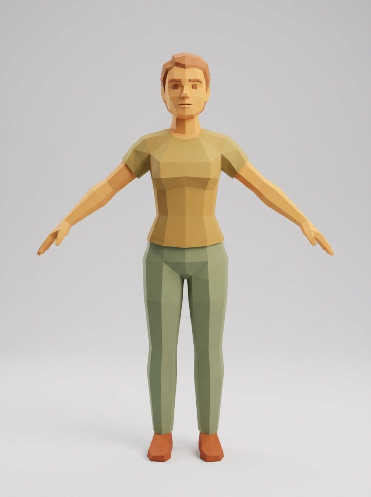 | 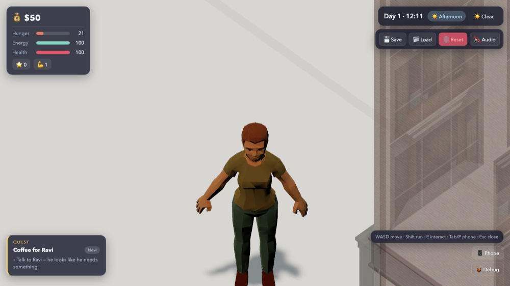 |

## Face — interaction distance
Front, three-quarter left/right, profile. Midday sun casts a natural brow shadow over the eye
sockets; the facial **structure** (nose, mouth, jaw, cheeks, hairline) reads, the **eyes** sit in
shadow at this hour. This is honest engine lighting — judge accordingly.

| Front | 3/4 left | 3/4 right | Profile |
|---|---|---|---|
|  | 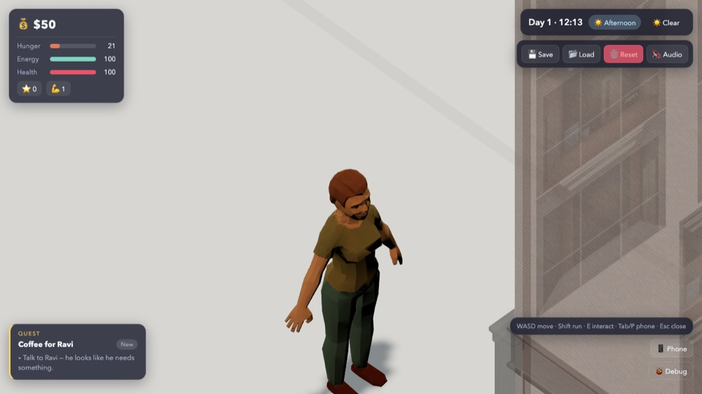 | 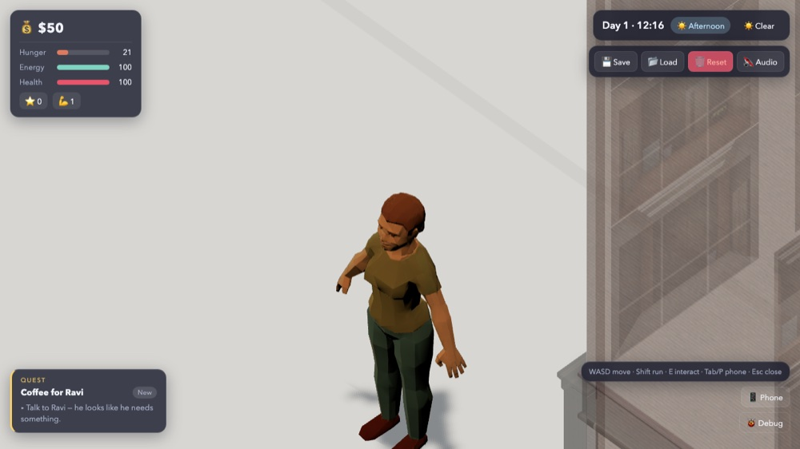 | 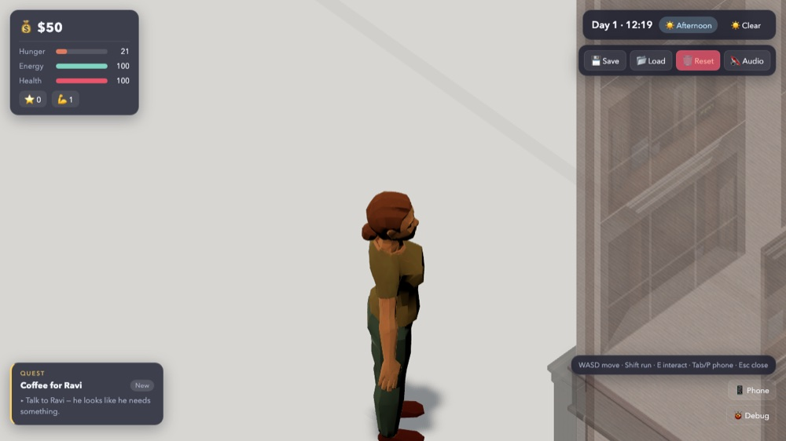 |

## Body — grounded, full length
Feet on the ground (feet at y=0), ~1.75 m. Front / side / rear.

| Front | Side | Rear |
|---|---|---|
|  | 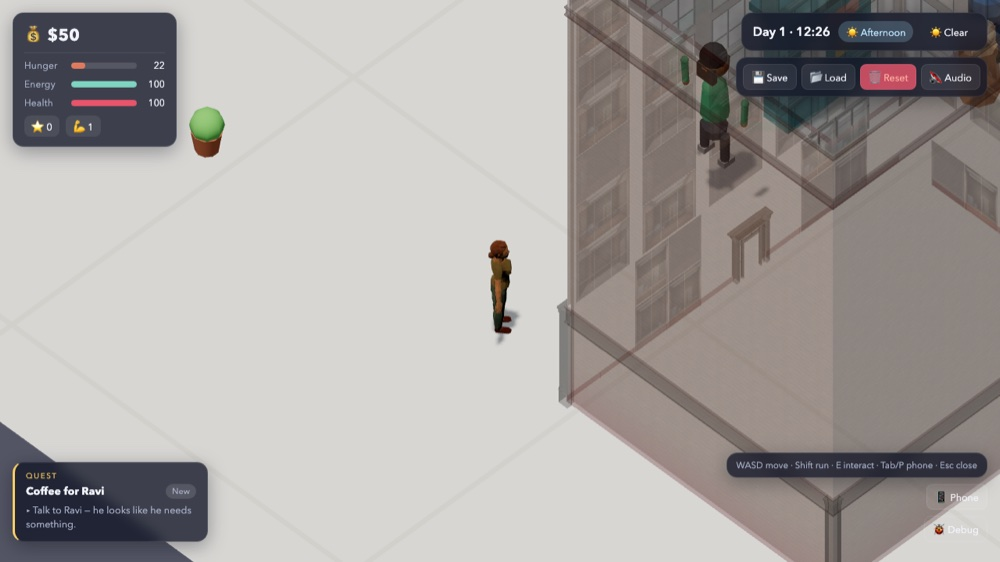 |  |

## Gameplay-distance comparison — current human vs candidate
Same camera, zoom and lighting. Left: the **primitive human that ships today** (`blocklife_person`,
cylinder limbs, no face/hands). Right: the calibration candidate.

| Current primitive (ships today) | Calibration candidate |
|---|---|
| 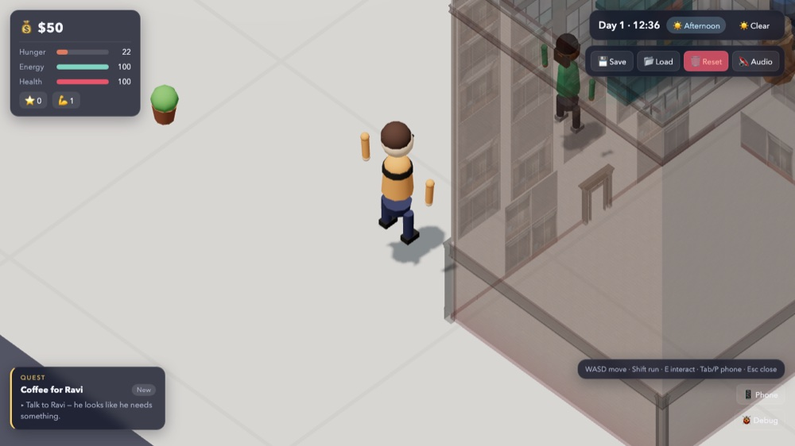 |  |

## Lighting conditions — day / night / rain
Responds to scene lighting (no self-glow; a proper dark silhouette at night).

| Day | Night | Rain |
|---|---|---|
|  | 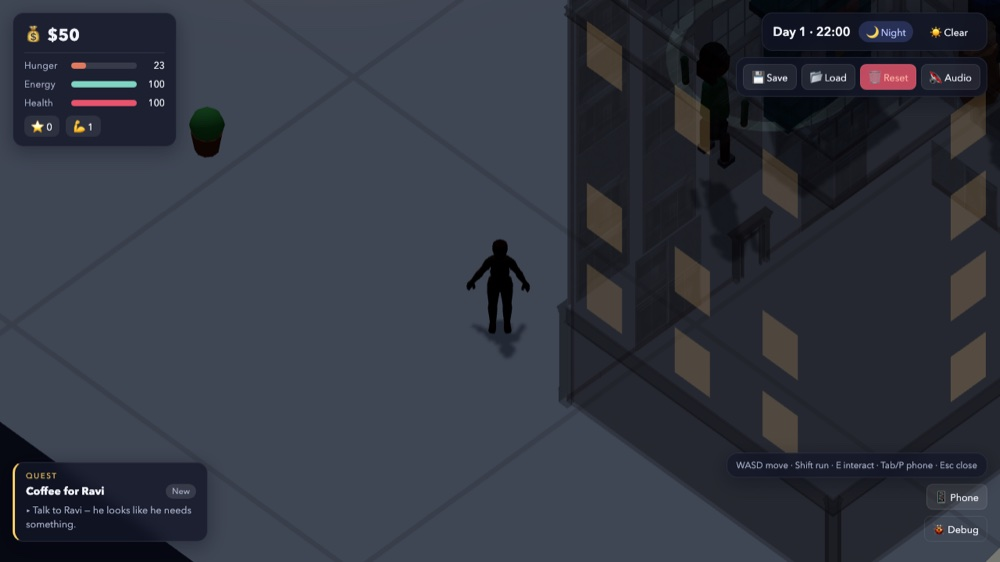 | 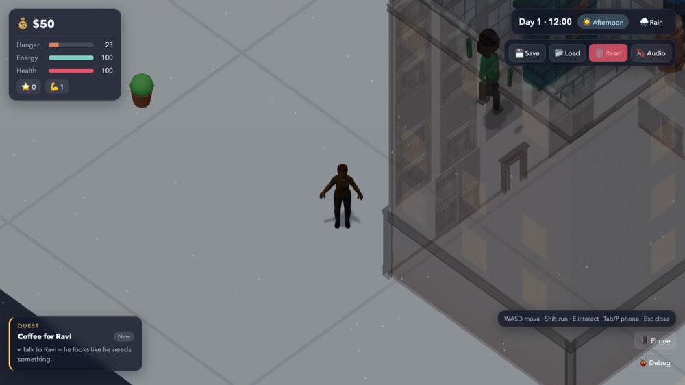 |

## Motion — three frames per clip
Idle / Walk / Run are **controller-selected** by gait through the real
`CharacterAnimationController`. Turn is an embedded diagnostic clip shown via **forced-clip** (it has
no production semantic role — see the mapping table below).

**Idle** &nbsp;   

**Walk** &nbsp; 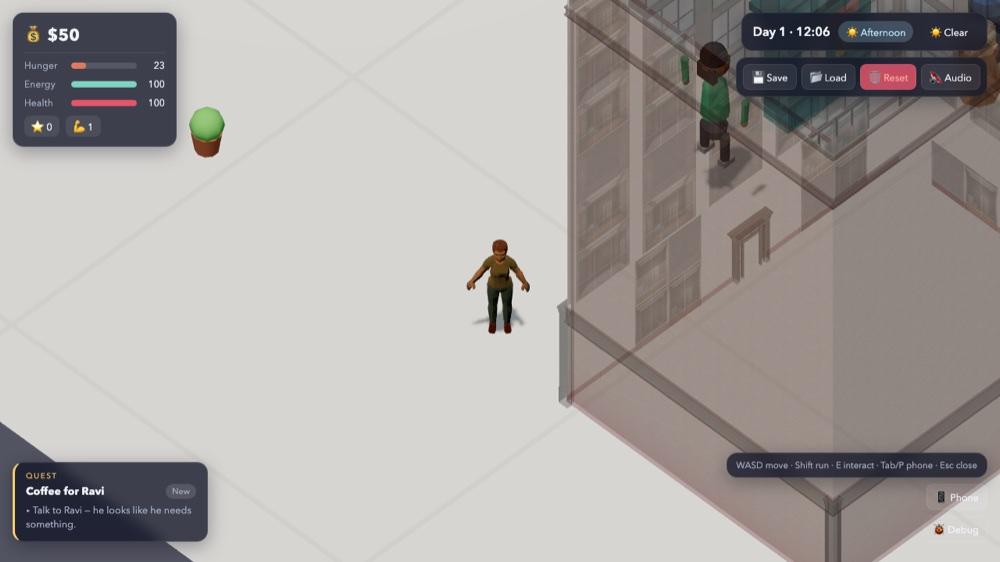  

**Run** &nbsp;   

**Turn** (forced-clip) &nbsp; 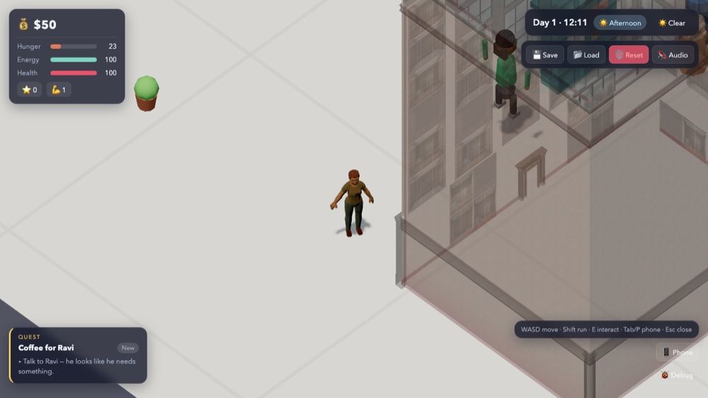  

## Seated — fitted to an authored bench
Seated on `prop_bench_01` (an authored park bench), lowered so the hips rest on the seat and the feet
reach the ground — **not floating in empty space**.

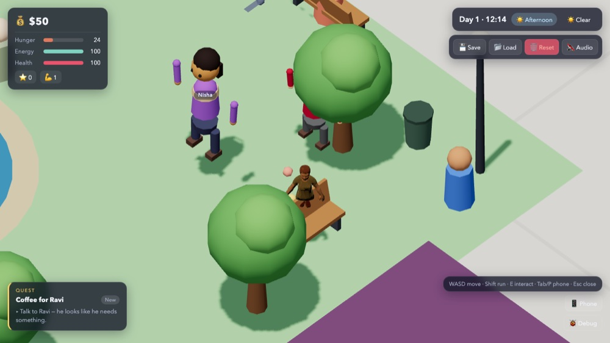  

---

## Animation: embedded vs runtime-mapped (B3)
The GLB physically embeds **5** clips. Only three are mapped to runtime semantic roles in the review
def; Turn and Seated are embedded diagnostics exercised by forced-clip only.

| Clip (embedded) | Source | Runtime semantic role | How reviewed |
|---|---|---|---|
| Idle | authored | `idle` | controller-selected (gait) |
| Walk | Meshy Smart-Rig (free) | `walk` | controller-selected (gait) |
| Run | Meshy Smart-Rig (free) | `run` | controller-selected (gait) |
| Turn | authored | — (none) | forced-clip |
| Seated | authored | — (none) | forced-clip (on bench anchor) |

## Provenance & credits
`text_to_image` ref (9) → `meshy_image_to_3d` t-pose (30) → `meshy_remesh` 8000 (5, → 7 605 tris +
normal map) → `meshy_rig` (5; **free walk/run** from the rig's `basic_animations` `_withSkin.glb`) →
assembled to one GLB (gltf-transform; free walk/run merged in-place + authored idle/turn/seated) →
1024 webp. **Total 49 credits.** Full write-up + versioned animation spec: `docs/HUMAN_PROOF_H0.md`.

## Known limitations (honest)
- Eyes read as shadowed sockets under midday overhead sun (see the face row); structure reads, eyes do not pop.
- Hands/feet are simplified low-poly (visible in the body row).
- Turn/Seated are authored diagnostics, not production-integrated animation states.
- This is ONE calibration human; identity is "adult calibration human", not a confirmed gender/age target.
